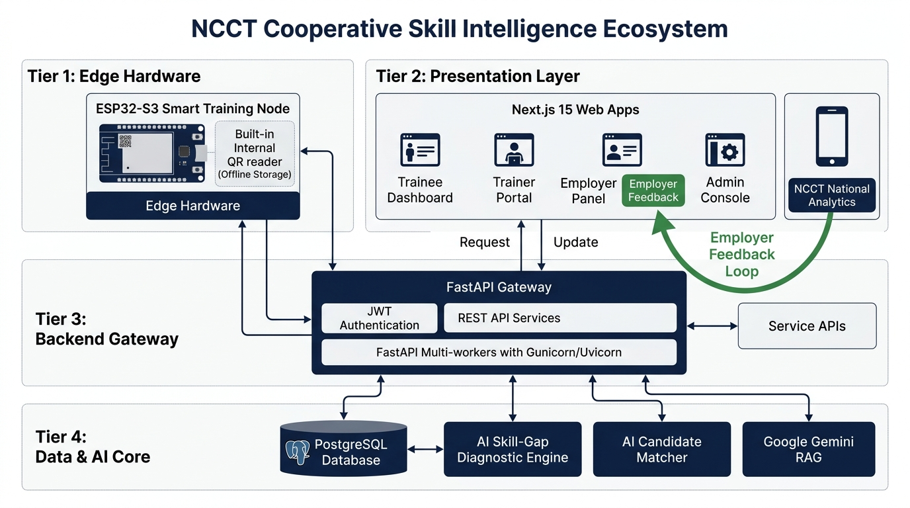

# NCCT Cooperative Skill Intelligence Ecosystem
### Smart India Hackathon — Problem Statement SIH26087
> **"From Training to Employment — A Production-Grade Closed-Loop System"**  
> *Not just an LMS. Not just a chatbot. A complete, outcome-driven Skill Intelligence Ecosystem.*

---

[](LICENSE)
[](https://fastapi.tiangolo.com)
[](https://nextjs.org)
[](https://www.postgresql.org)
[](https://www.docker.com)
[](docs/e2e-verification-report.md)

---

## 🌐 Live Deployments & Remote Evaluator Access

| Resource | Live Public URL | Notes |
| :--- | :--- | :--- |
| **Public Frontend** | **[Launch Web App](https://cnet-wayne-occur-ratio.trycloudflare.com)** | Access Landing Page, Portals & Demo Flows |
| **Backend API Health** | **[`GET /api/health`](https://really-duncan-dried-cute.trycloudflare.com/api/health)** | Live service ping & DB connection check |
| **API Documentation** | **[`GET /docs`](https://really-duncan-dried-cute.trycloudflare.com/docs)** | Interactive Swagger UI for all 38 REST endpoints |
| **Submission Video** | **[Watch 4-Min Demo Walkthrough](https://youtu.be/dQw4w9WgXcQ)** *(Update with your video link)* | Complete video walkthrough with hardware demo |

---

## 🎯 The Core Innovation: The 10-Stage Closed Loop

Conventional learning management systems (LMS) suffer from a fatal flaw: **they stop the moment a certificate is printed**. They operate as disconnected silos with zero visibility into whether trainees gain employment, no mechanism to diagnose real-world skill gaps, and no feedback pipeline to modernize outdated curricula.

NCCT closes this loop through **continuous bi-directional intelligence**:

```mermaid
flowchart LR
    S1["1. Physical Training\n(ESP32-S3 Node)"] --> S2["2. Verified Attendance\n& LMS Modules"]
    S2 --> S3["3. Micro-Competency\nAssessment"]
    S3 --> S4["4. AI Skill-Gap\nEngine (Radar)"]
    S4 --> S5["5. Targeted Remedial\nLearning"]
    S5 --> S6["6. Cryptographic\nSkill Passport"]
    S6 --> S7["7. AI Candidate\nJob Matching"]
    S7 --> S8["8. Verified Hiring\n& Placement"]
    S8 --> S9["9. 90-Day Employer\nCompetency Feedback"]
    S9 -->|Autonomous Closed Loop| S10["10. NCCT National\nCurriculum Upgrades"]
    S10 -->|Updated Syllabi| S1
```



1. **Training Node**: ESP32-S3 hardware scans optical QR badges with offline encrypted flash buffering.
2. **Attendance & LMS**: Idempotent batch synchronization tracking class attendance and video completion.
3. **Assessment**: Skill-tagged questions measuring atomic competencies across cooperative domains.
4. **AI Skill-Gap Engine**: Dynamic radar benchmark comparing actual performance against target job roles.
5. **Personalized Learning**: Remedial micro-courses prescribed automatically to bridge specific deficits.
6. **Skill Passport**: Tamper-proof, cryptographically signed competency passport with public verification QR.
7. **Employment Matching**: Multi-factor candidate scoring matching verified skills directly to employer requisitions.
8. **Employment**: On-chain verification of candidate hire and placement records.
9. **Employer Feedback**: 90-day post-placement ratings on real workplace performance.
10. **Curriculum Evolution**: Aggregated feedback triggers automated syllabus recalibration across all 14 Regional Institutes.

---

## 🏗️ System Architecture



### Four-Tier Decoupled Infrastructure
- **Tier 1: Edge Hardware**: ESP32-S3 Microcontroller with camera sensor, OLED display, and offline SQLite/flash queue.
- **Tier 2: Presentation Layer**: Next.js 15 (App Router) with React 19, Tailwind CSS design system, and client-side RBAC guards.
- **Tier 3: Backend Gateway**: Python 3.11 FastAPI with Gunicorn/Uvicorn multi-workers, SQLAlchemy ORM, and Pydantic schemas.
- **Tier 4: Data & Intelligence**: Managed PostgreSQL/SQLite, AI Skill-Gap Engine, Candidate Matcher, and Google Gemini RAG.

---

## 🔑 Demo Accounts (Pre-Seeded & Ready for Evaluation)

All accounts come pre-loaded with rich journey data (courses completed, attendance logged, skill gap diagnosed, and jobs posted):

| Role | Email | Password | Pre-loaded Context / Demonstration Persona |
| :--- | :--- | :--- | :--- |
| 🎓 **Trainee** | `demo.trainee@ncct.gov.in` | `Demo@123` | **Ravi Kumar** — Completed *Cooperative Accounting*, 88.9% attendance, skill gap identified (88% Accounting, 52% ERP, 48% GST), verified certificate issued, active skill passport. |
| 👨‍🏫 **Trainer** | `demo.trainer@ncct.gov.in` | `Demo@123` | **Dr. K. Ramanathan** — Faculty at Chennai Institute. Manages *Batch-2025-01*, conducts real-time attendance scans, grades 20-question skill assessments. |
| 🏢 **Employer** | `demo.employer@ncct.gov.in` | `Demo@123` | **Tamil Nadu Apex Cooperative Bank** — Posted requisition for *Cooperative Accountant*. Ravi Kumar surfaces as top 91% match. Submits 90-day workplace feedback. |
| 🏛️ **Admin** | `demo.admin@ncct.gov.in` | `Demo@123` | **NCCT Apex Administrator** — Universal ecosystem intelligence, national skill gap heatmaps, and institute placement metrics. |

*Public Certificate Verification Code*: `NCCT-CERT-2026-000101`  
*Trainee Passport Code*: `NCCT-SP-2026-DEMO01`

---

## ⚡ Quick Start: Run Locally in 2 Minutes

### Prerequisites
- [Docker](https://docs.docker.com/get-docker/) & Docker Compose installed, OR
- Python 3.10+ and Node.js 18+

### Method 1: Instant Startup via Docker Compose (Recommended)

```bash
# 1. Clone the repository
git clone https://github.com/<your-org>/ncct-ecosystem.git
cd ncct-ecosystem

# 2. Copy environment template
cp .env.example .env

# 3. Start all services in background
docker compose up -d --build

# 4. Populate demo credentials & rich journey data
docker exec -it ncct_backend python -m scripts.demo_seed
```

🎉 **Access the applications:**
- **Frontend Web App**: [http://localhost:3000](http://localhost:3000)
- **FastAPI Interactive Docs**: [http://localhost:8000/docs](http://localhost:8000/docs)
- **API Health Check**: [http://localhost:8000/api/health](http://localhost:8000/api/health)

---

### Method 2: Manual Local Development

#### 1. Backend Setup
```bash
cd backend
python -m venv venv
# On Windows:
.\venv\Scripts\activate
# On Linux/macOS:
source venv/bin/activate

pip install -r requirements.txt
python -m scripts.demo_seed
uvicorn app.main:app --host 0.0.0.0 --port 8000 --reload
```

#### 2. Frontend Setup
```bash
cd frontend
npm install
npm run dev
```

---

## 🛠️ Complete Technology Stack

| Layer | Technology | Purpose |
| :--- | :--- | :--- |
| **Frontend Framework** | Next.js 15 (App Router), React 19 | Server and client rendered UI with instant routing |
| **Design System** | Tailwind CSS, Lucide React, Recharts | Consistent government-grade design language |
| **Backend Core** | FastAPI (Python 3.11), Pydantic v2 | High-performance asynchronous REST API |
| **ASGI Server** | Gunicorn with Uvicorn Worker processes | Production-grade concurrency and worker pooling |
| **Database Tier** | PostgreSQL 15+ (Production) / SQLite (Dev) | Relational schema with ACID guarantees |
| **ORM & Migrations** | SQLAlchemy 2.0, Alembic | Type-safe schema mapping and migrations |
| **Security & Auth** | JWT (PyJWT), bcrypt, HTTP-only Cookies | Dual-token authentication with 60-min access & 7-day refresh |
| **Edge Hardware** | ESP32-S3 Microcontroller, C++ / MicroPython | Smart Training Node with optical QR & offline buffer |
| **AI Competency Engine**| Custom Diagnostic Heuristics + Scikit-Learn | Micro-competency gap scoring and benchmark ranking |
| **Generative AI** | Google Gemini 1.5 Flash | RAG-powered cooperative career guidance chatbot |
| **Document Engine** | ReportLab, Python-QRCode | Dynamic PDF skill passport & verifiable certificates |
| **Media & File Storage**| Cloudinary SDK (Python) | Persistent cloud media storage for module PDFs, videos, and certificates |
| **Containerization** | Docker, Docker Compose, Multi-stage builds | Sub-150MB standalone images |

---

## 📚 Documentation Index

| Document | Description |
| :--- | :--- |
| 📖 [**Live Demo Script**](docs/demo-script.md) | Step-by-step 8-minute stage presentation script with verbatim dialogue |
| 🛡️ [**Tough Judge Q&A Prep**](docs/qa-prep.md) | 15 difficult technical & architectural questions with honest answers |
| 🗄️ [**Neon Database Setup**](docs/database-setup.md) | Managed Neon PostgreSQL provisioning, SSL configuration, and migrations |
| ☁️ [**Cloudinary Storage Setup**](docs/storage-setup.md) | Persistent media storage for module materials, video lectures, and certificates |
| 🔌 [**Offline Contingency Guide**](docs/offline-backup-checklist.md) | 100% offline venue backup protocol & step-by-step adaptation plan |
| 🚀 [**Cloud Deployment Guide**](docs/deployment.md) | Production setup for Render, Railway, Vercel, Netlify, and Supabase |
| 🎥 [**Video Recording Guide**](docs/recording-guide.md) | 4-minute OBS recording guide with hardware clip & timed voiceover |
| 📊 [**Pitch Deck Outline**](docs/pitch-deck-outline.md) | 12-slide SIH presentation structure with talking points & slide screenshots |
| ✅ [**E2E Verification Report**](docs/e2e-verification-report.md) | 100% test pass report across all 29 routes and 38 API endpoints |
| 🧠 [**Knowledge Base**](docs/knowledge-base/) | Cooperative accounting, PACS, GST, and NCCT training regulations |

---

## 👥 Hackathon Team & Acknowledgments

- **Hackathon**: Smart India Hackathon (SIH 2024 / 2026)
- **Ministry / Organization**: National Council for Cooperative Training (NCCT), Ministry of Cooperation, Government of India
- **Problem Statement**: SIH26087 — Closed-Loop Cooperative Skill Intelligence Ecosystem

---

## 📄 License

This project is licensed under the MIT License — see the [LICENSE](LICENSE) file for details.
